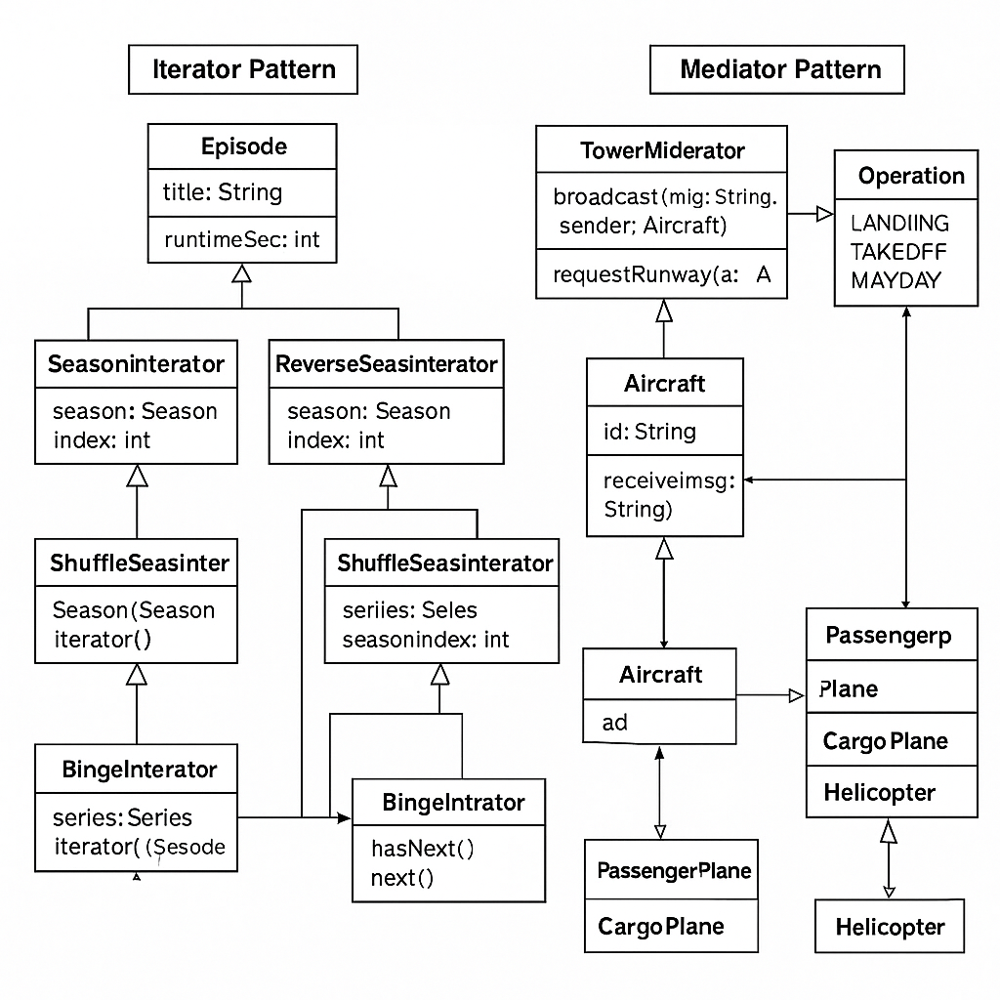

# 🚀 solution_homework_7 🚀

## 🔭 Overview
This repo showcases two classic Java design patterns—served with a side of rocket fuel! 🎉

1. **Iterator Pattern** (`streaming`) 🚀  
   - Walk through a list of `Episode` objects in:
     - ➡️ **Normal** (`SeasonIterator`)
     - 🔄 **Reverse** (`ReverseSeasonIterator`)
     - 🎲 **Shuffle** (fixed‐seed `ShuffleSeasonIterator`)  
   - Chain whole seasons into a “binge” marathon with `BingeIterator`.  
   - Leverage `Iterable<Episode>` to power your `for (Episode e : season)` and `for (Episode e : series)` loops.

2. **Mediator Pattern** (`airport`) ✈️  
   - Central hub (`ControlTower`) for aircraft communication.  
   - Aircraft types (`PassengerPlane`, `CargoPlane`, `Helicopter`) request LANDING, TAKEOFF, or trigger MAYDAY emergencies.  
   - Tower keeps separate queues, fast-tracks emergencies, and broadcasts instructions.

---
HERE MY UML DIAGRAM:
 
if it doesn't open, then here is an alternative:
@startuml
' --- Iterator Pattern ---
package "Iterator Pattern" {
  class Episode {
    - title: String
    - runtimeSec: int
    + getTitle(): String
    + getRuntimeSec(): int
  }

  interface EpisodeIterator {
    + hasNext(): boolean
    + next(): Episode
  }

  class Season {
    - episodes: List<Episode>
    + addEpisode(e: Episode): void
    + iterator(): EpisodeIterator
  }

  class SeasonIterator {
    - season: Season
    - index: int
    + hasNext(): boolean
    + next(): Episode
  }

  class ReverseSeasonIterator {
    - season: Season
    - index: int
    + hasNext(): boolean
    + next(): Episode
  }

  class ShuffleSeasonIterator {
    - season: Season
    - shuffled: List<Episode>
    - index: int
    + hasNext(): boolean
    + next(): Episode
  }

  class Series {
    - seasons: List<Season>
    + addSeason(s: Season): void
    + iterator(): EpisodeIterator
  }

  class BingeIterator {
    - series: Series
    - seasonIndex: int
    - current: EpisodeIterator
    + hasNext(): boolean
    + next(): Episode
  }

  EpisodeIterator <|.. SeasonIterator
  EpisodeIterator <|.. ReverseSeasonIterator
  EpisodeIterator <|.. ShuffleSeasonIterator
  EpisodeIterator <|.. BingeIterator

  Season "1" *-- "*" Episode
  Season "1" o-- "1" SeasonIterator
  Season "1" o-- "1" ReverseSeasonIterator
  Season "1" o-- "1" ShuffleSeasonIterator
  Series "1" *-- "*" Season
  Series "1" o-- "1" BingeIterator
}

' --- Mediator Pattern ---
package "Mediator Pattern" {
  interface TowerMediator {
    + broadcast(msg: String, sender: Aircraft): void
    + requestRunway(a: Aircraft): boolean
  }

  class ControlTower {
    - landingQueue: Queue<Aircraft>
    - takeoffQueue: Queue<Aircraft>
    + broadcast(msg: String, sender: Aircraft): void
    + requestRunway(a: Aircraft): boolean
  }

  enum Operation {
    LANDING
    TAKEOFF
    MAYDAY
  }

  abstract class Aircraft {
    - id: String
    + receive(msg: String): void
    + send(msg: String, m: TowerMediator): void
  }

  class PassengerPlane
  class CargoPlane
  class Helicopter

  TowerMediator <|.. ControlTower
  Aircraft <|-- PassengerPlane
  Aircraft <|-- CargoPlane
  Aircraft <|-- Helicopter

  ControlTower "1" o-- "*" Aircraft : manages >
  Aircraft --> TowerMediator : uses >
}

' --- Application (demo) ---
class Application {
  + main(args: String[]): void
}
Application --> Season
Application --> Series
Application --> ControlTower
@enduml

## 📂 Project Structure
├─ src/
│ ├─ Episode.java
│ ├─ EpisodeIterator.java
│ ├─ Season.java
│ ├─ SeasonIterator.java
│ ├─ ReverseSeasonIterator.java
│ ├─ ShuffleSeasonIterator.java
│ ├─ Series.java
│ ├─ BingeIterator.java
│ ├─ TowerMediator.java
│ ├─ Operation.java
│ ├─ ControlTower.java
│ ├─ Aircraft.java
│ ├─ PassengerPlane.java
│ ├─ CargoPlane.java
│ ├─ Helicopter.java
│ └─ Application.java
└─ README.md

##⚖️ EXAMPLE OUTPUT
== Normal ==
Pilot
Cliffhanger

== Reverse ==
Cliffhanger
Pilot

== Shuffle (seed=42) ==
Pilot
Cliffhanger

== Binge ==
Pilot
Cliffhanger

== Mediator ==
PassengerPlane P1: Cleared to land.
Helicopter H1: Cleared for takeoff.
CargoPlane C1: Cleared to land.
